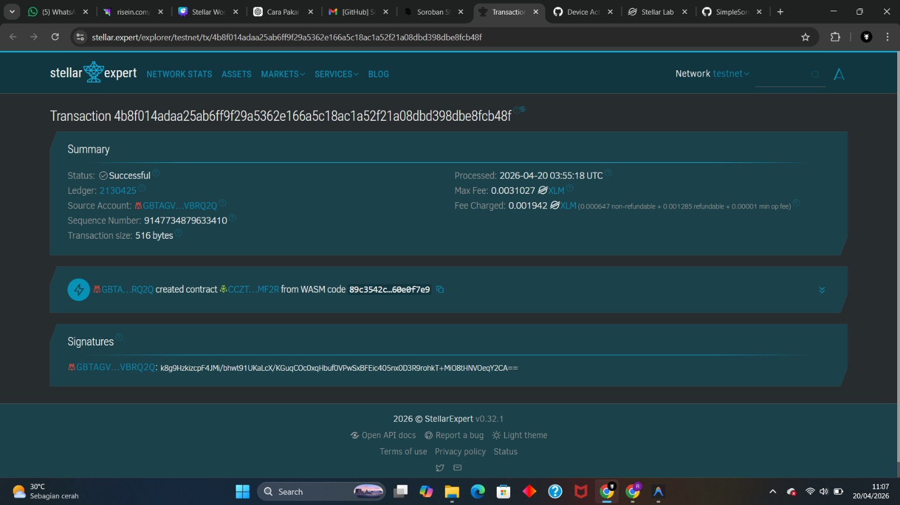

# Simple Soroban Voting dApp

A simple, transparent, and secure decentralized voting application built on the Soroban (Stellar) smart contract framework.

## Features
- **One Address, One Vote**: Prevents double-voting by using the voter's wallet address as a unique identity.
- **Transparency**: Real-time voting results are stored directly on the blockchain.
- **Security**: Utilizes `require_auth()` to ensure that the vote is cast only by the actual owner of the address.

## Project Structure
- `src/lib.rs`: The main smart contract logic.
- `src/test.rs`: Unit tests to validate logic without requiring network deployment.
- `Cargo.toml`: Dependency configuration and WebAssembly (WASM) optimization settings.

## How to Use via Soroban IDE (Playground)
To try this code in the [Soroban IDE](https://soroban.stellar.org/playground/):
1. Copy the entire content of `src/lib.rs` (and `src/test.rs` if you wish to run tests there).
2. In the Soroban IDE, create a new project and paste the code into the editor.
3. Click the **Build** button to compile the contract.
4. Use the **Invoke** panel to call the `vote` or `get_votes` functions.

## Local Development (CLI)
If you have `soroban-cli` and Rust installed locally:

### 1. Build the Contract
```bash
cargo build --target wasm32-unknown-unknown --release
```

### 2. Run Tests
```bash
cargo test
```

### 3. Deploy to Testnet
```bash
soroban contract deploy \
  --wasm target/wasm32-unknown-unknown/release/simple_voting.wasm \
  --source <YOUR_ACCOUNT> \
  --network testnet
```

## Example Interactions (CLI)

### Casting a Vote for Candidate "A"
```bash
soroban contract invoke --id <CONTRACT_ID> \
  --source <YOUR_ACCOUNT> \
  --network testnet -- \
  vote --voter <YOUR_ADDRESS> --candidate A
```

### Getting Vote Totals for Candidate "A"
```bash
soroban contract invoke --id <CONTRACT_ID> \
  --network testnet -- \
  get_votes --candidate A
```

### Screenshot

